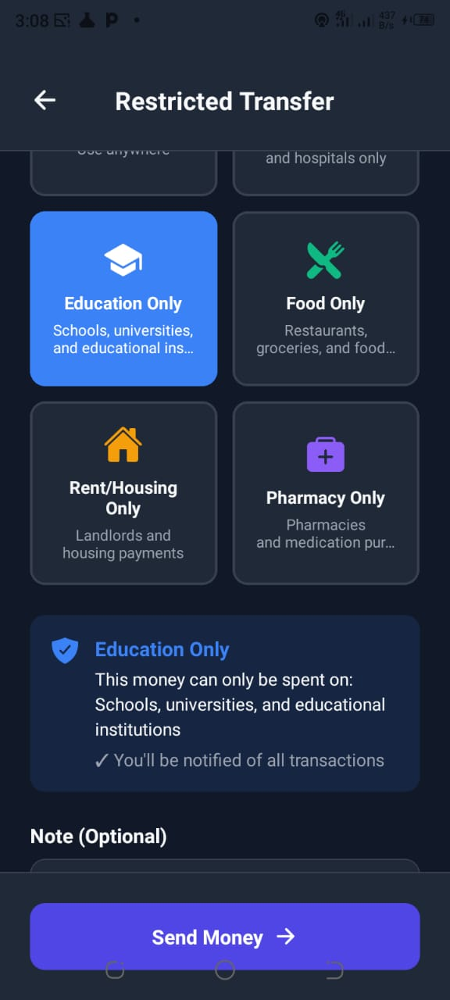
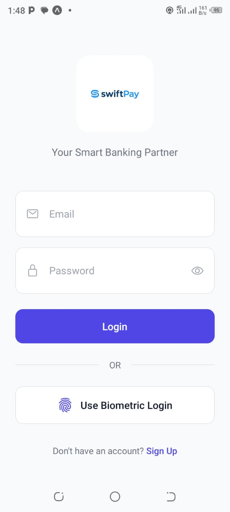
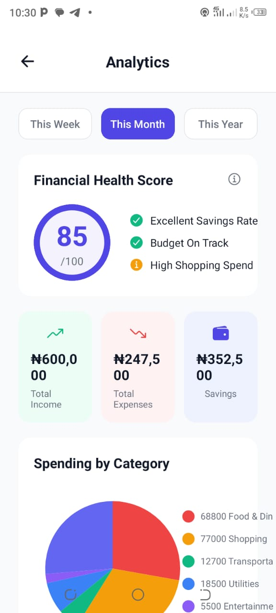

# 💳 SwiftPay - Mobile Banking Application

A full-featured mobile banking app built with React Native, featuring **restricted spending transfers**, real payment integration, GPS location services, data analytics, and comprehensive card management.

  

---

**[📥 Try SwiftPay (Download APK)](https://expo.dev/accounts/uchechi1998/projects/swiftpay/builds/6ee9a5b3-2139-4162-baef-14e972fd645a)** | **[📺 Watch Demo](#-screenshots)** | **[📖 Documentation](#-features)**

---

## 🚀 Key Innovation: Restricted Spending

**The Problem:** Nigerian diaspora sends $25 BILLION home yearly, but families often misuse funds - hospital money goes to food, school fees to shopping.

**SwiftPay's Solution:** Purpose-restricted transfers with category enforcement.

**How it works:**
- Sender marks money as "Hospital Only" 🏥
- Recipient can ONLY spend at hospitals
- Attempts to spend elsewhere are BLOCKED ❌
- Sender gets real-time notifications

**Use Cases:**
- Medical remittances
- Educational support
- Elderly care payments
- Property management
- Trust fund disbursements

---

## ✨ Features

### 🔐 Authentication & Security
- **Biometric Authentication** - Face ID/Touch ID login
- **Secure Card Management** - Freeze/unfreeze cards instantly
- **Real-time Fraud Alerts** - Instant notifications for suspicious activity

### 💰 Payments & Transfers
- **Restricted Spending Transfers** - Purpose-bound money (Hospital, Education, Food, Rent, Pharmacy)
- **Paystack Integration** - Real payment processing with Nigerian banks
- **QR Code Payments** - Generate and scan QR codes for instant transfers
- **Multi-Account Management** - Checking, Savings, and Investment accounts

### 📍 Location Services
- **GPS ATM Finder** - Google Maps integration with distance calculation
- **Nearest ATM Sorting** - Haversine formula for accurate distances
- **Get Directions** - One-tap navigation to selected ATM/bank

### 📊 Analytics & Insights
- **Spending Analytics** - Interactive charts (Pie, Bar, Line)
- **Financial Health Score** - 0-100 rating based on savings and spending
- **Category Breakdown** - Detailed spending by category
- **Smart Insights** - AI-powered financial recommendations

### 💳 Card Management
- **Instant Freeze/Unfreeze** - One-tap card security
- **View Card Details** - Secure CVV and full number display
- **Spending Limits** - Daily and monthly caps with progress bars
- **Report Lost/Stolen** - Immediate blocking with replacement request

### 🎨 User Experience
- **Dark Mode** - Seamless theme switching with optimized colors
- **Notification Center** - Real-time alerts categorized by type
- **Transaction Search** - Search by recipient, category, or amount
- **Multi-currency Support** - Naira (₦) formatting and calculations

---

## 🛠️ Tech Stack

**Frontend:**
- React Native (Expo SDK 54)
- TypeScript
- React Navigation
- React Native Maps
- React Native Chart Kit

**APIs & Integrations:**
- Paystack Payment API
- Google Maps API
- Expo Location
- Expo Local Authentication (Biometric)
- Expo Camera (QR Scanner)

**State Management:**
- React Context API
- React Hooks

**Styling:**
- React Native StyleSheet
- Custom Theme System
- Dark Mode Support

---

## 📱 Screenshots

<p align="center">
  
  
  
  
</p>

---

## 📦 Download & Install

### Try SwiftPay Now! (Android)

**[📥 Download SwiftPay APK](https://expo.dev/accounts/uchechi1998/projects/swiftpay/builds/6ee9a5b3-2139-4162-baef-14e972fd645a)**

**Installation Instructions:**
1. Click the download link on your Android phone
2. Download the APK file
3. Open the downloaded file
4. Allow "Install from unknown sources" if prompted
5. Install and launch SwiftPay!

**Test Credentials:**
- Use Face ID/Touch ID to login
- Explore all 11 features

**System Requirements:**
- Android 6.0 or higher
- 100 MB free storage
- Internet connection for maps and payments

---


## 🏃‍♂️ Getting Started

### Prerequisites
- Node.js (v18 or higher)
- npm or yarn
- Expo CLI
- Android Studio (for Android) or Xcode (for iOS)

### Installation

1. **Clone the repository**
```bash
git clone https://github.com/ChukwukaRosemary23/SwiftPay.git
cd SwiftPay
```

2. **Install dependencies**
```bash
npm install
```

3. **Start the development server**
```bash
npx expo start
```

4. **Run on device/emulator**
- Press `a` for Android
- Press `i` for iOS
- Scan QR code with Expo Go app

---

## 📦 Building APK

### Development Build
```bash
eas build --profile development --platform android
```

### Production Build
```bash
eas build --profile preview --platform android
```

Download the APK from the Expo dashboard or use the provided link.

---

## 🎯 Project Structure
```
SwiftPay/
├── screens/          # All screen components
├── context/          # Theme and state management
├── data/             # Mock data and types
├── assets/           # Images and icons
├── App.tsx           # Root component
└── package.json      # Dependencies
```

---

## 🔮 Future Enhancements

- [ ] Blockchain verification for merchant categories
- [ ] Multi-currency wallet
- [ ] Peer-to-peer lending
- [ ] Investment portfolios
- [ ] Bill splitting
- [ ] Savings goals with automation
- [ ] Cryptocurrency integration

---

## 📊 Project Stats

- **Development Time:** 9 weeks
- **Total Features:** 11 major features
- **Lines of Code:** 5,000+
- **Screens:** 12+
- **Reusable Components:** 20+

---

## 🤝 Contributing

This is a portfolio project, but feedback and suggestions are welcome!

1. Fork the repository
2. Create a feature branch (`git checkout -b feature/AmazingFeature`)
3. Commit your changes (`git commit -m 'Add some AmazingFeature'`)
4. Push to the branch (`git push origin feature/AmazingFeature`)
5. Open a Pull Request

---

## 📄 License

This project is open source and available under the MIT License.

---

## 👩‍💻 Author

**Love (Rosemary) Chukwuka**
- Full Stack Software Engineer
- MERN Stack | React Native | TypeScript| Go
- LinkedIn: https://www.linkedin.com/in/chukwuka-rosemary-0944b9244/
- GitHub: [@ChukwukaRosemary23](https://github.com/ChukwukaRosemary23)

---

## 🙏 Acknowledgments

- Expo team for amazing tools
- Paystack for payment integration
- Google Maps for location services
- React Native community

---

## 📞 Contact

For questions, collaborations, or opportunities:
- Email: chukwukarosemary2020@gmail.com
- LinkedIn: https://www.linkedin.com/in/chukwuka-rosemary-0944b9244/****

---

**Built with ❤️ in Nigeria 🇳🇬**

*Solving real problems with innovative technology*
